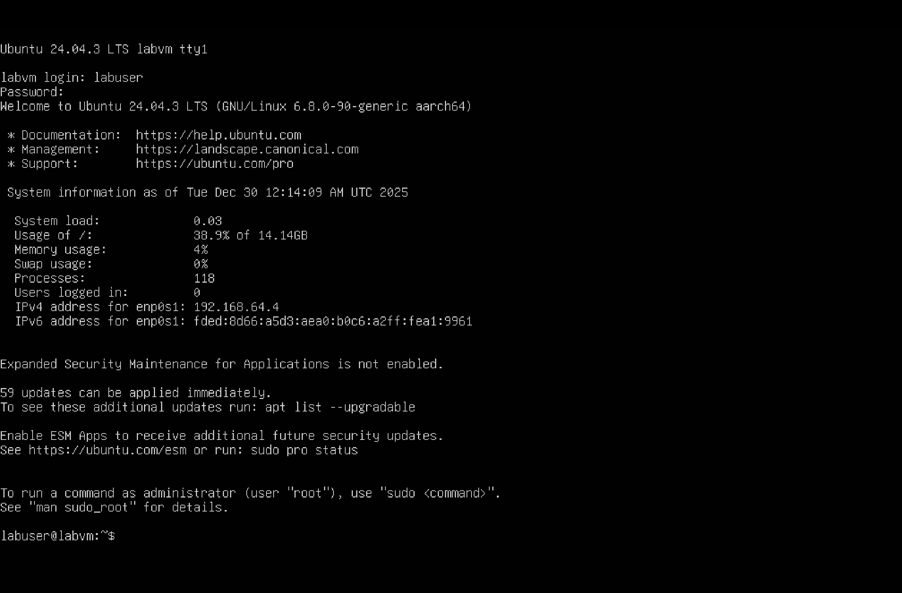
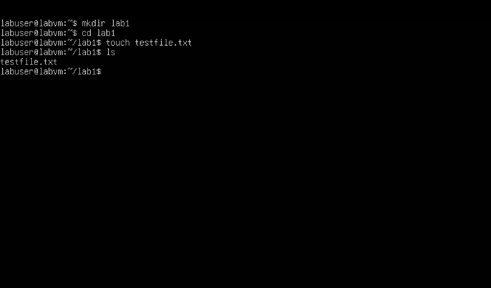

# Day 1 – Linux Terminal & File Navigation

## Objective
Set up a Linux VM and practice basic terminal navigation and file operations.

## Environment
- Host: macOS (Apple Silicon)
- VM: Ubuntu Server 22.04 LTS
- Virtualization: UTM

## Tasks Completed
- Installed Ubuntu Linux in a virtual machine
- Logged into the system via terminal
- Navigated the filesystem using `pwd`, `ls`, and `cd`
- Created and removed directories and files using `mkdir`, `touch`, `rm`, and `rmdir`

## What I Learned
- Linux directory navigation
- Basic file and folder management from the terminal
- Viewing system information and environment
- Command line fundamentals

## Screenshots

