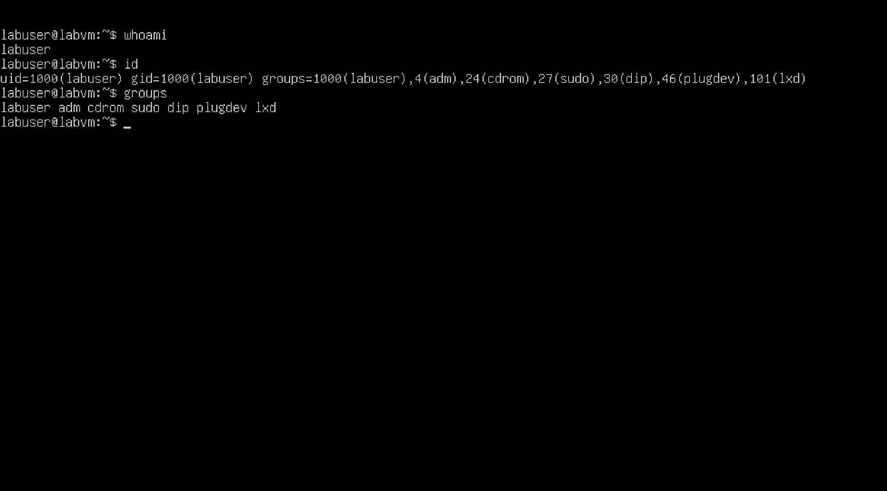
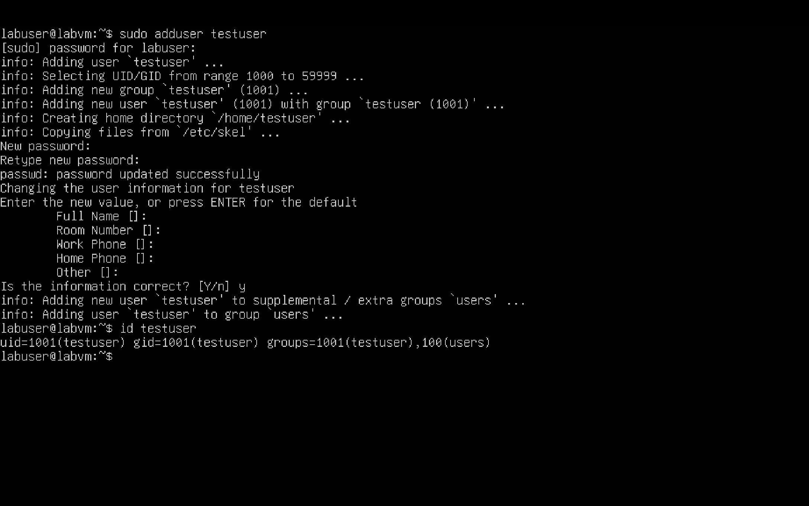
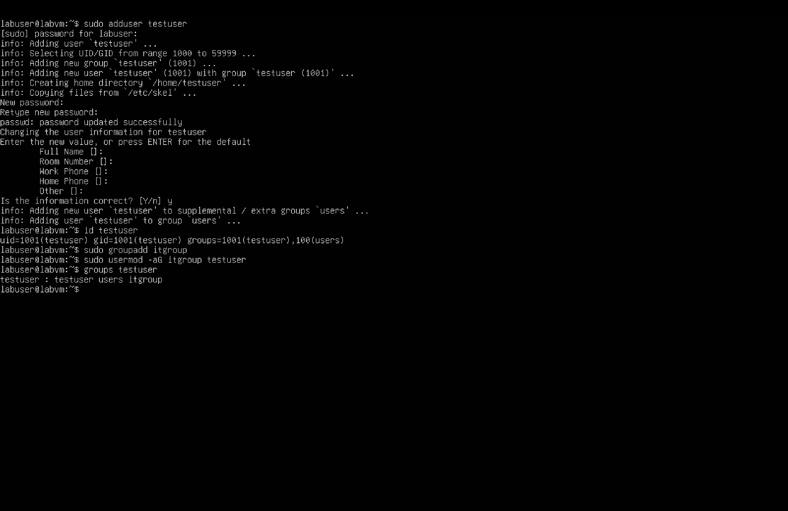

# Day 2 – Users & Groups

## Objective
Practice Linux user and group management.

## Tasks Completed
- Checked current user and groups
- Created a new user: testuser
- Created a new group: itgroup
- Added testuser to itgroup
- Verified group membership

## Screenshots

