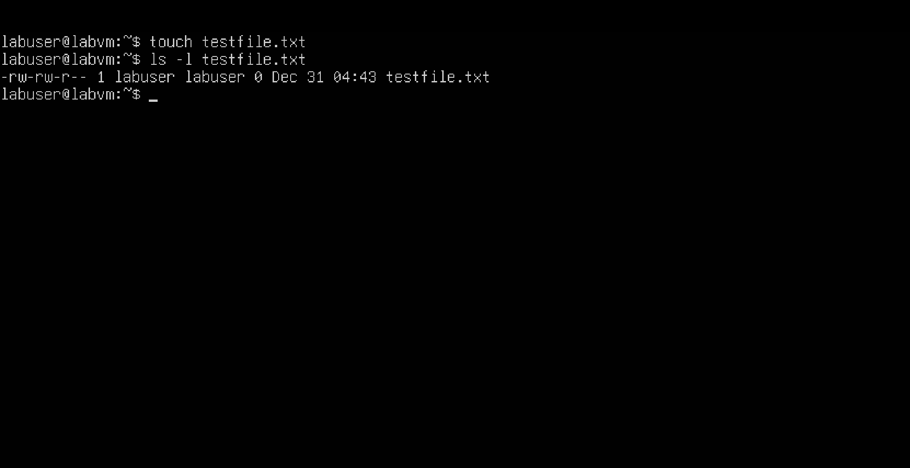
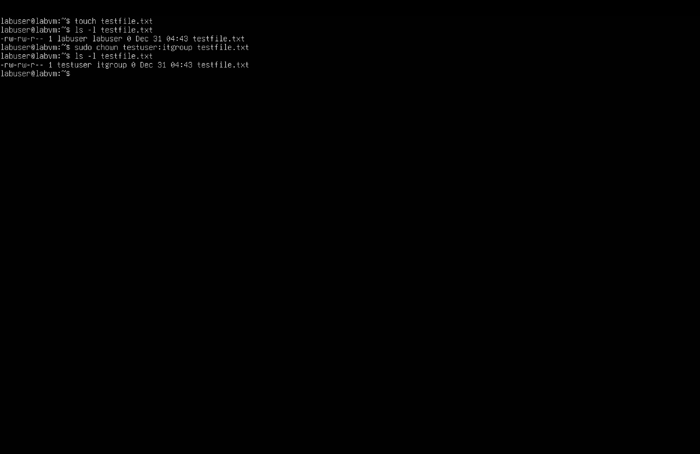
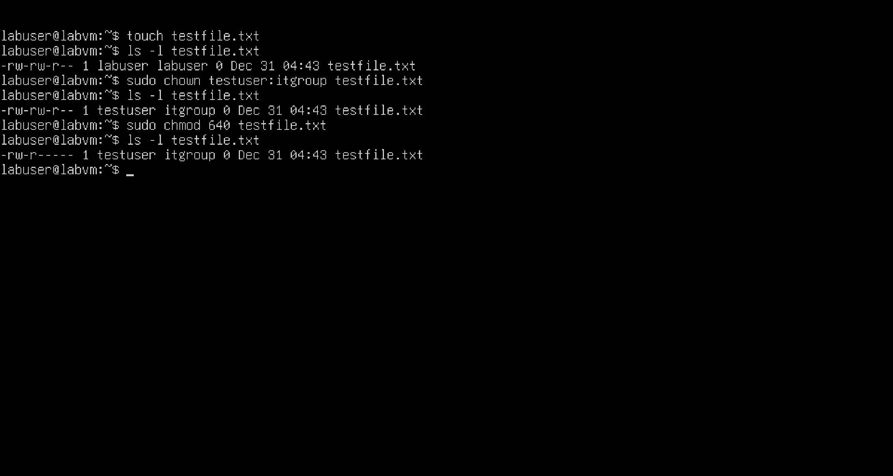

# Day 3 – Permissions & Ownership

## Objective
Practice Linux file ownership and permissions.

## Tasks Completed
- Created a test file
- Checked initial ownership and permissions
- Changed ownership to testuser:itgroup
- Changed permissions to 640
- Verified file status with ls -l

## Screenshots

