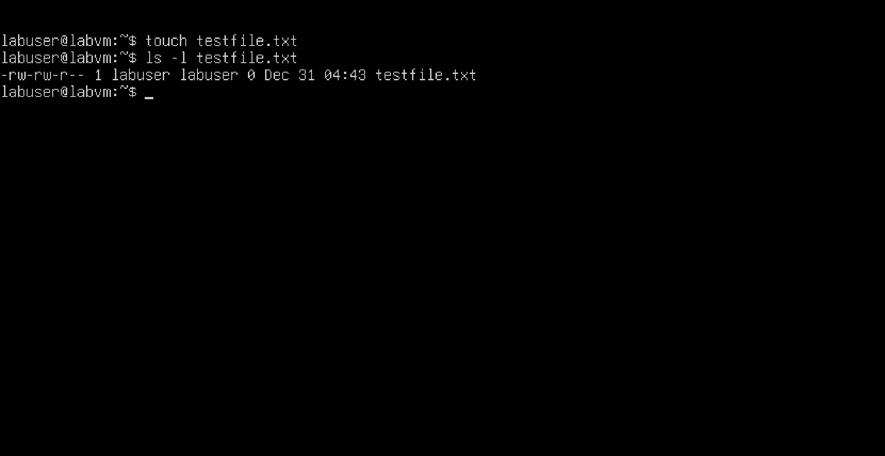
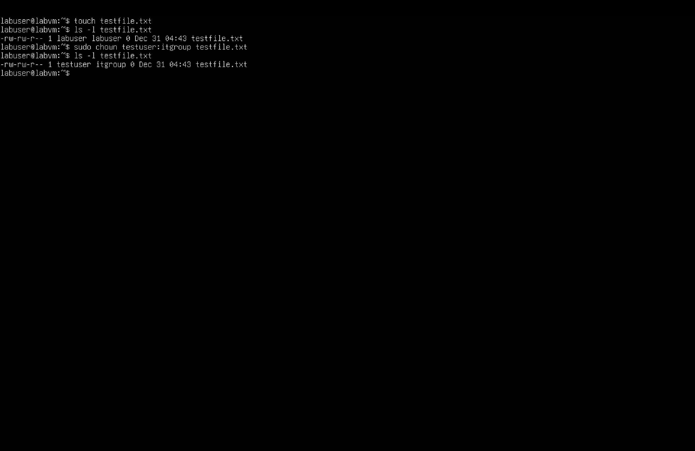
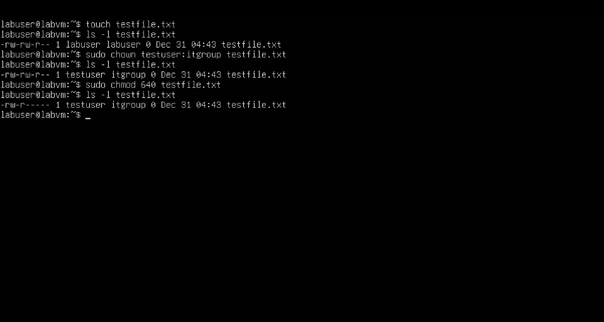

# Day 3 – Permissions & Ownership

## Objective
Practice Linux file ownership and permissions.

## Tasks Completed
- Created test file
- Checked ownership and permissions
- Changed ownership to testuser:itgroup
- Changed permissions to 640 (rw-r-----)
- Verified file status with ls -l

## What I Learned
- File ownership and permissions
- User and group distinctions
- Basic file and directory management
- Security implications for permissions

## Screenshots

