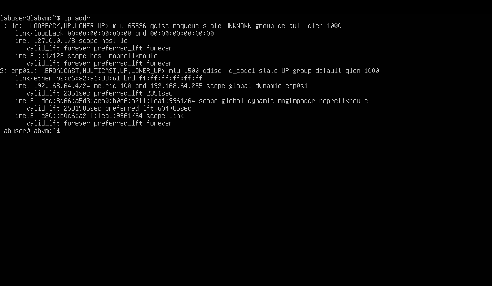
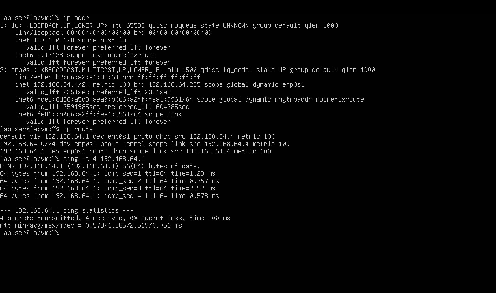
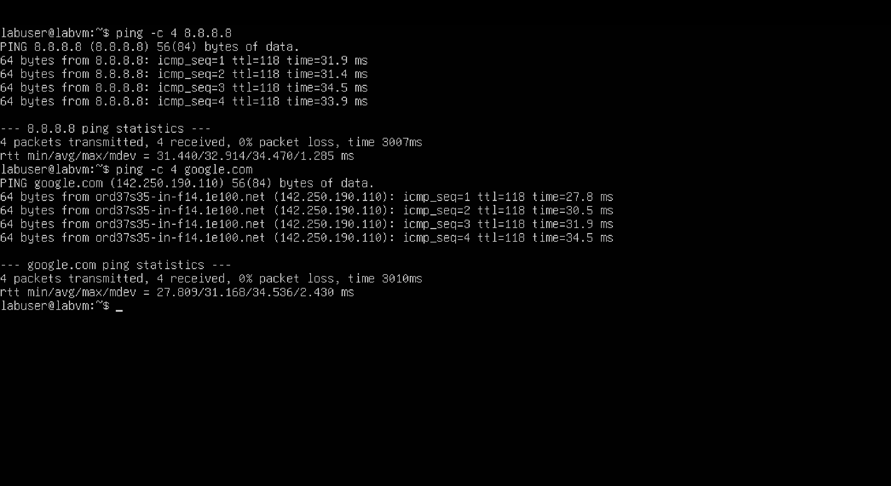
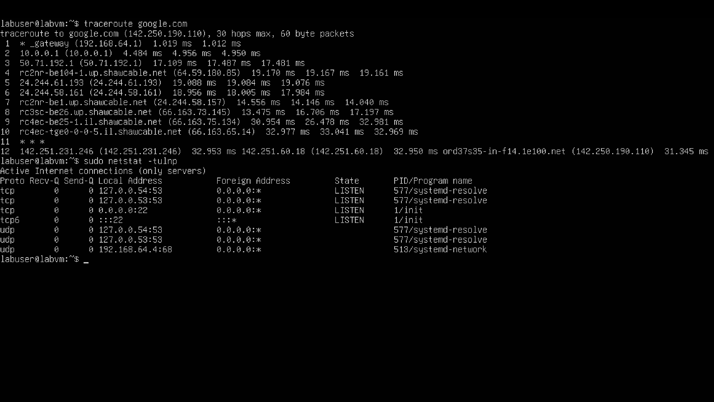

# Day 4 – Networking & Sysadmin Basics

## Objective
Practice basic networking and system diagnostics on Linux.

## Tasks Completed
- Checked network interfaces and IP address
- Determined default gateway
- Pinged gateway and external IPs
- Tested DNS resolution by pinging google.com
- Ran traceroute to trace network path to Google
- Checked open ports and listening services on VM

## What I Learned
- Network interface identification
- Connectivity testing (ping/traceroute)
- Checking open ports and network stats
- Basic network troubleshooting

## Screenshots

