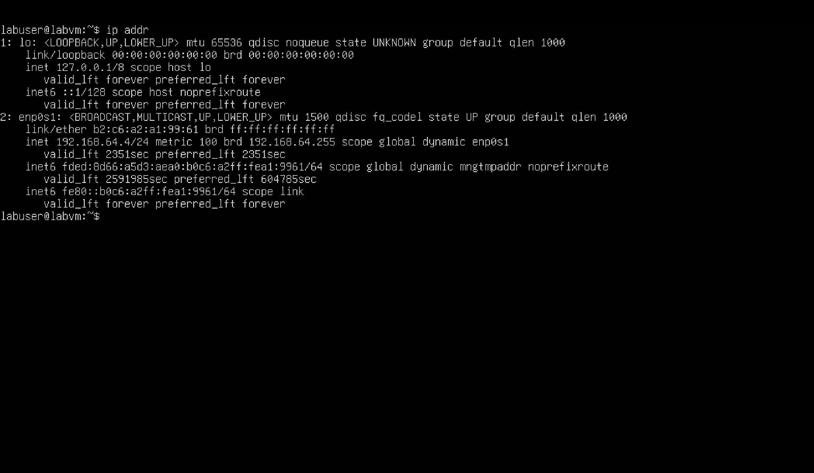
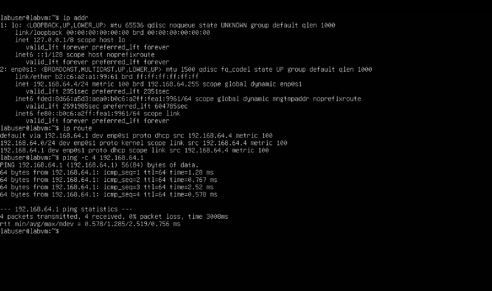
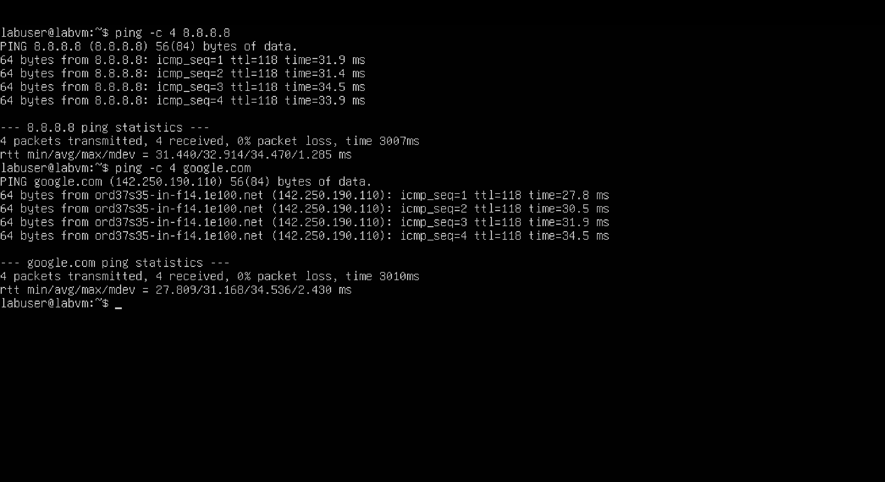
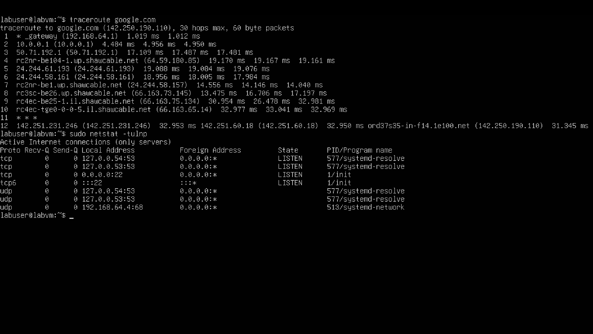

# Day 4 – Networking & Sysadmin Basics

## Objective
Practice basic networking diagnostics on Linux.

## Tasks Completed
- Checked network interfaces and IP address
- Determined default gateway
- Pinged gateway and external IP addresses
- Tested DNS resolution by pinging google.com (8.8.8.8)
- Ran traceroute for network path to google.com
- Checked open ports and listening services on VM

## What I Learned
- Network interface identification
- Connectivity testing (ping/traceroute)
- Checking open ports and network statistics
- Basic network troubleshooting

## Screenshots

