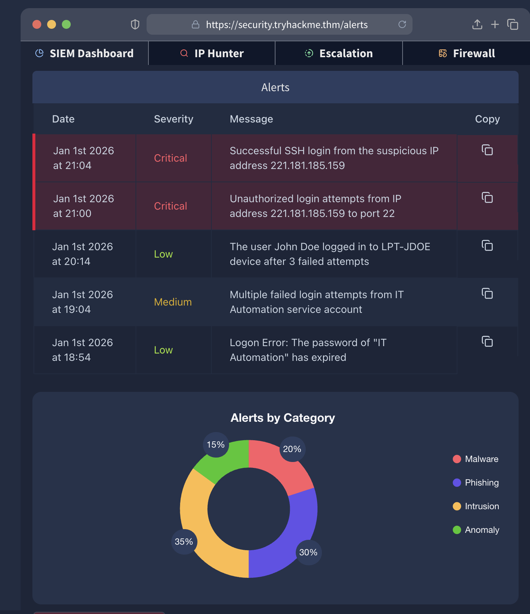

# Day 5 – SOC Analyst (Blue Team Intro)

## Objective
Introduce basic SOC (Security Operations Center) and blue team concepts through hands-on investigation of security alerts using a simulated SIEM.

## Tasks Completed
- Reviewed introductory SOC and blue team concepts
- Investigated alerts in a simulated SIEM environment
- Identified a malicious IP address
- Analyzed attacker activity associated with the IP
- Escalated issue following standard SOC procedures
- Added the malicious IP to a block list

## Screenshots

