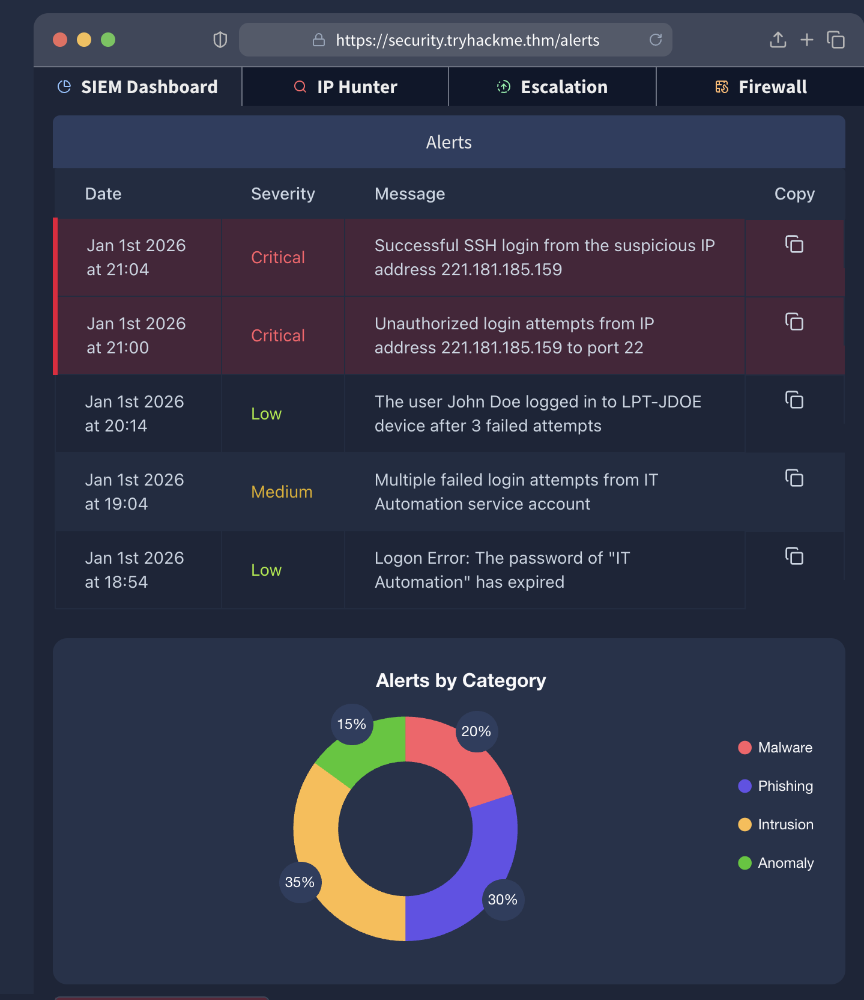
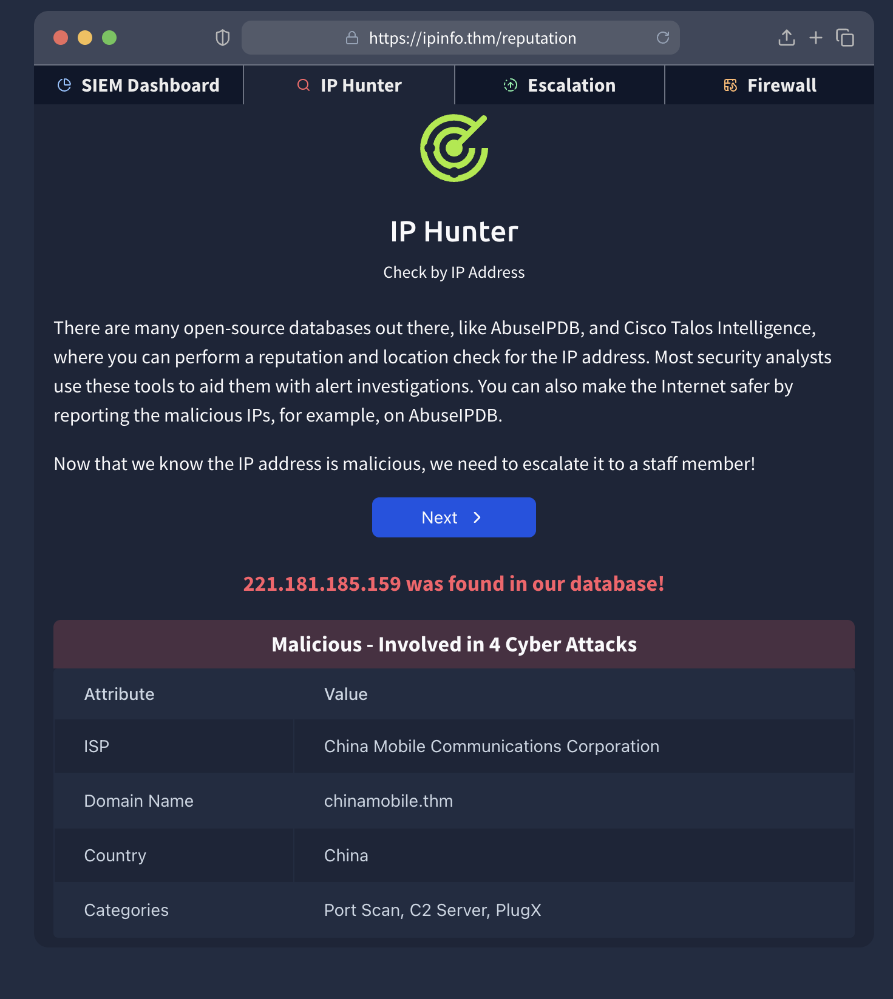
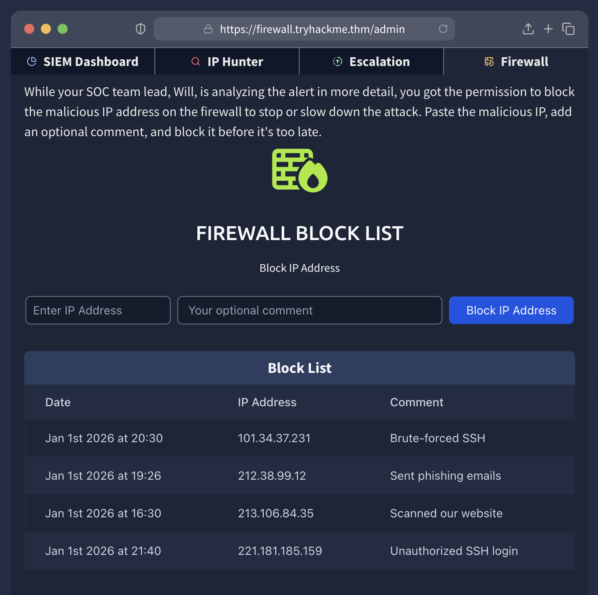

# Day 5 – SOC Analyst (Blue Team Intro)

## Objective
Introduce basic SOC (Security Operations Center) and blue team concepts through investigation of security alerts in simulated SIEM.

## Tasks Completed
- Reviewed introductory SOC and blue team concepts
- Investigated alerts in a simulated SIEM environment
- Identified a malicious IP address and analyzed its activity
- Escalated issue following SOC procedures
- Added the malicious IP to a block list

## What I Learned
- Security monitoring workflows
- Identification of malicious IPs
- SIEM dashboards navigation
- Threat detection and escalation

## Screenshots

