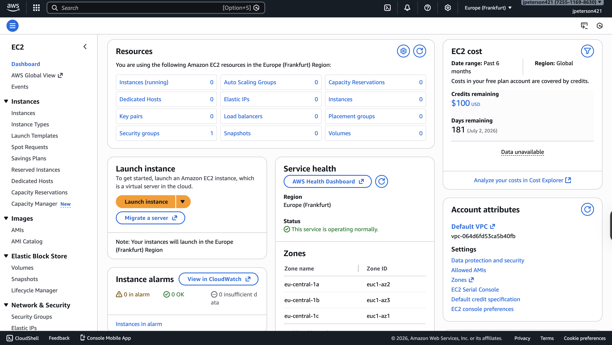
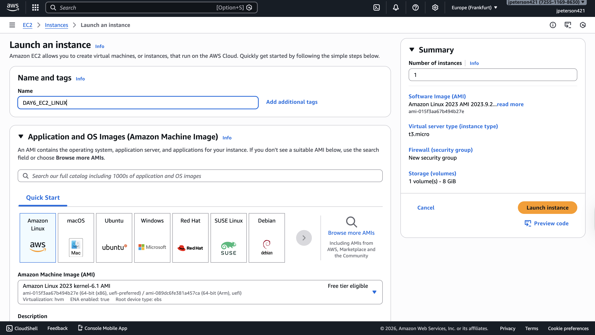
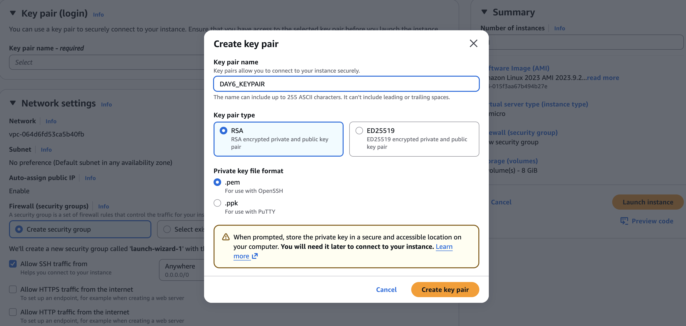
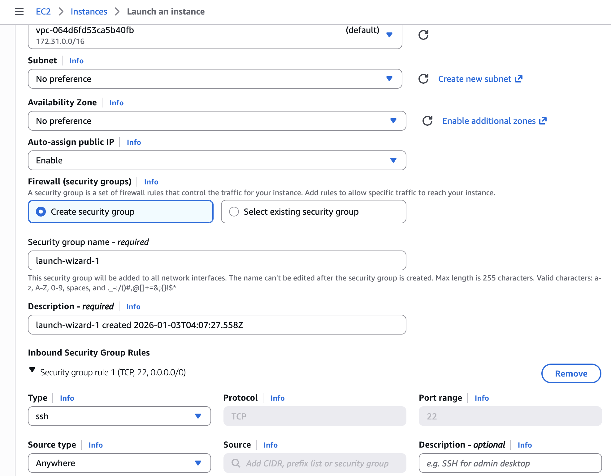
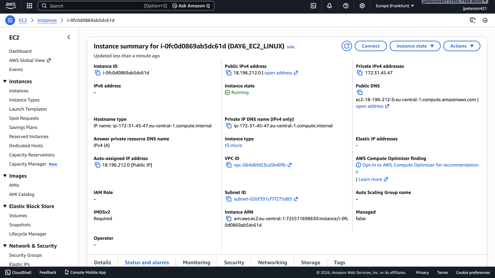
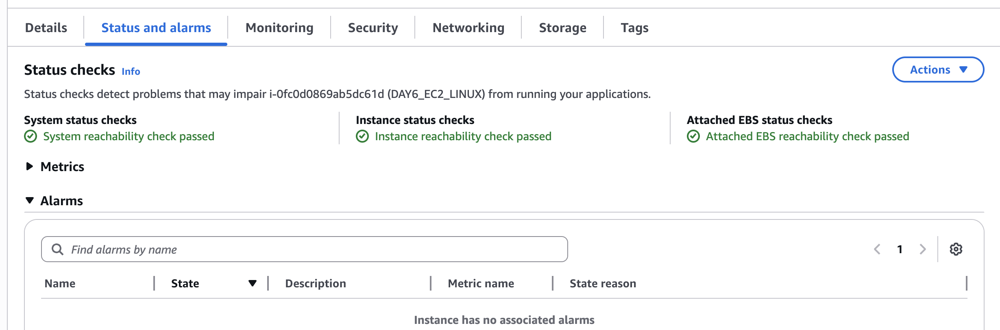

# Day 6 – AWS EC2 (Cloud Fundamentals)

## Objective
Gain hands-on experience with basic cloud infrastructure by deploying a virtual server using Amazon Web Services (AWS).

## Tasks Completed
- Navigated the AWS EC2 dashboard
- Configured and launched an EC2 instance
- Named the instance and selected Amazon Linux AMI
- Configured instance type (Free Tier)
- Created and configured an SSH key pair
- Configured security group to allow SSH access
- Verified instance is running and healthy

## What I Learned
- Navigating AWS Management Console
- Launching and configuring EC2 instances
- Security group configuration
- Basic cloud infrastructure concepts

## Screenshots

